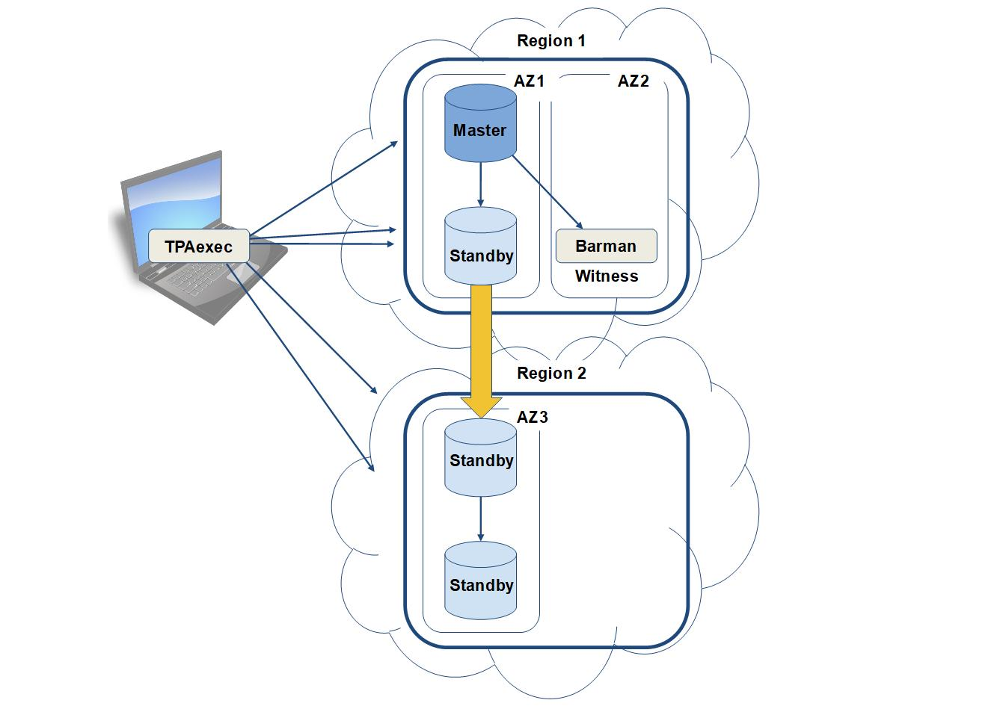

TPAexec - Cluster design and implementation considerations
==========================================================

© Copyright 2ndQuadrant, 2018. Confidential property of 2ndQuadrant; not for public release.
### TPAexec Overview

**TPAexec** is an orchestration tool from 2ndQuadrant that enables the repeatable and automated deployment of highly available PostgreSQL clusters that conform to TPA (Trusted PostgreSQL Architecture). It sets up a fully working database cluster with multiple nodes, replication and backup - all integrated and fully tested for both performance and high availability.

TPAexec setup works in Stages:

- Provisioning
- Deployment (includes Customization, Testing and Verification)

and can also be used for

- Rehydration [used for rapid deployment of patches or OS upgrades to Amazon Web Services (**AWS**) Elastic Compute Cloud (**EC2**) instances]

In its current form, it is used to manage AWS EC2 instances via a command line interface, although managing other cloud technologies may be possible in future releases.

TPAexec itself can run locally or remotely to the cloud being managed (e.g. from a laptop, linux VM, AWS instance).

------

### AWS Fundamentals

The AWS Elastic Compute Cloud (**EC2**) is physically subdivided first into [Regions](https://docs.aws.amazon.com/AWSEC2/latest/UserGuide/using-regions-availability-zones.html) and further into Availability Zones. Each Availability Zone is isolated, but the Availability Zones in a region are connected through low-latency links. An Availability Zone is represented by a region code followed by a letter identifier; e.g. `eu-east-1a`. Note that `eu-east-1a` might not be the same location as `eu-east-1a` for another account, and there is no way to coordinate Availability Zones between accounts.

Within Availability Zones, you can create [**Instances**](https://docs.aws.amazon.com/AWSEC2/latest/UserGuide/Instances.html) (Virtual Machines) and storage volumes.

The instances are built using templates known as [Amazon Machine Images (**AMI**s](https://docs.aws.amazon.com/AWSEC2/latest/UserGuide/AMIs.html)), which can be preconfigured with OS and bespoke packages, allowing for fast deployment times. These AMIs are region specific, so when creating them, make sure that they are available in each region that you will be using.

Amazon have various HW configs available, known as **[Instance Types](https://docs.aws.amazon.com/AWSEC2/latest/UserGuide/instance-types.html)**, with various price performance points. 

The storage volumes that we use are called [Amazon Elastic Block Store (**EBS**)](https://docs.aws.amazon.com/AWSEC2/latest/UserGuide/AmazonEBS.html) volumes, which provide persistent storage for the server instances.

To specify the protocols, ports, and source IP ranges that can reach the server instances, you can define **[Security Groups](https://docs.aws.amazon.com/AWSEC2/latest/UserGuide/using-network-security.html#vpc-security-groups)**, which are effectively a set of firewall rules.

You can create Virtual networks which are logically isolated from the rest of the AWS cloud, and can optionally be connected to your own network - these are known as virtual private clouds ([**VPC**s](https://docs.aws.amazon.com/AWSEC2/latest/UserGuide/using-vpc.html))

It is possible to assign Static IPv4 addresses to instances, known as **[Elastic IP](https://docs.aws.amazon.com/AWSEC2/latest/UserGuide/elastic-ip-addresses-eip.html)** addresses, or to allow AWS to assign a public IP address from the EC2-VPC public IPv4 address pool. Elastic IPs are region specific, externally accessible IPv4 addresses that are associated with your AWS account, and can be quickly associated with any instance in that region. When you allow AWS to configure an [external IPv4 address](https://docs.aws.amazon.com/AWSEC2/latest/UserGuide/using-instance-addressing.html#concepts-public-addresses), it is configured at instance boot time. *Note this address is released at shutdown time, and it is not possible to retain the same address after reboot.*

During instance build, [key pairs](https://docs.aws.amazon.com/AWSEC2/latest/UserGuide/ec2-key-pairs.html) are created/assigned to allow secure login to the instances. (It is possible to assign existing keys to the instances). If you lose your private key, you will irrevocably lose access to the instances - having access to the AWS console does not help.

------

### Design Considerations

When creating a PostgreSQL cluster using TPAexec, it is worth spending a little preparation time to work out  some of the details. You should decide whether the cluster requires resilience - if so, how much? What topology of replication will be used? 

AWS regions have multiple Availability Zones connected via low-latency links, however Data Centres (**DC**s) hosting all the AZs in a region are hosted in the same geographic location, so consideration should be taken as to what Disaster Recovery (**DR**) resilience is appropriate, and whether DCs should be placed in different regions. An AWS VPC can span multiple AZs, however it does not span regions, so when creating multi-region clusters, something like OpenVPN can be used to provide connectivity.

For a Highly Available (HA) cluster, you will need to place at least 3 DB servers in the main DC (DC 1), so that in the event of the current master failing and a standby being promoted, the new master still has one standby available locally as a failover target.

To achieve DR resilience, you should to place backup standby DB servers in a second DC (DC 2), replicating them directly or by using cascading replication. If using **repmgr** to manage automatic failover, then care needs to be taken to avoid a split-brain scenario. Split-brain can happen when there is a network failure between both DCs, where a DB server in the DC 2 is promoted to master, so that there are masters in both DCs. To avoid this, it's possible to set up a "*witness server*" in DC 1 - if repmgr can't see either the witness or the primary server, it decides that there is a network failure and doesn't promote itself as master.

**Example of cascading replication**



**Figure 1**

In this example, in the event of failure of the master and main standby in Region 1 being promoted to master, no action is necessary for the downstream standbys in Region 2, as they will remain attached to the same host in Region 1, which is now the new master.
The downside of configuring it this way, rather than having each standby replicated from the master, is that the downstream standbys in Region 2 will receive changes more slowly, although this difference might not be significant. We have also designated the barman server as a witness server.

------

### Translating design into reality via config.yml

An example **config.yml** to create the cascading example shown in Figure 1 can be seen below. 

This example requires 3 VPC subnets, and is split between 2 regions, so OpenVPN was used to allow communication - the standby server in AZ1 was chosen as the OpenVPN gateway server, by giving it the role "openvpn-server". Depending on network or CPU performance constraints, it may be preferable to choose a different gateway server.

In order to build the correct topology, the tag "**upstream:** \<Name>" is used, so that the node can be configured to replicate from the required host.

If you are already using AWS in production, it is likely that you will need to use existing ssh keys to connect to the hosts - if this is the case, they can be set using "**ssh_key_file:** \<path to key file>", otherwise you can remove this line and new keys will be generated.

```
---

cluster_name: night
ssh_key_file: "../../id_night"
cluster_tags:
  Owner: Count Drac
cluster_vars:
  vpn_network: 192.168.33.0/24

ec2_vpc:
  Name: Test

ec2_vpc_subnets:
  eu-central-1:
    10.33.243.0/24:
      az: eu-central-1a
    10.33.122.0/24:
      az: eu-central-1b
  eu-west-1:
    10.33.6.0/24:
      az: eu-west-1a

ec2_ami:
  Name: TPA-RedHat-PGDG-10-2018*
  Owner: self
ec2_ami_user: ec2-user

instances:
    - node: 1
      Name: lab-primary
      type: t2.micro
      region: eu-central-1
      subnet: 10.33.243.0/24
      volumes:
          - raid_device: /dev/md0
            device_name: /dev/xvdb
            volume_type: gp2
            volume_size: 16
            raid_units: 2
            attach_existing: yes
            delete_on_termination: false
            vars:
              volume_for: postgres_data
      tags:
        role:
          - primary
          - openvpn-server
        backup: lab-backup
      vars:
        work_mem: 16MB

    - node: 2
      Name: lab-backup
      type: t2.micro
      region: eu-central-1
      subnet: 10.33.122.0/24
      volumes:
          - device_name: /dev/xvdb
            volume_type: gp2
            volume_size: 32
            attach_existing: yes
            delete_on_termination: false
            vars:
              volume_for: postgres_data
      tags:
        role:
          - barman
          - witness
          - log-server
        upstream: lab-primary

    - node: 3
      Name: lab-replica
      type: t2.micro
      region: eu-central-1
      subnet: 10.33.243.0/24
      volumes:
          - device_name: /dev/xvdb
            volume_type: gp2
            volume_size: 16
            attach_existing: yes
            delete_on_termination: false
            vars:
              mountpoint: /var/lib/postgresql
      tags:
        role:
          - replica
          - openvpn-server
        upstream: lab-primary
      vars:
        work_mem: 21MB
        postgres_data_dir: /var/lib/postgresql/data


    - node: 4
      Name: lab-replica2
      type: t2.micro
      region: eu-west-1
      subnet: 10.33.6.0/24
      volumes:
          - device_name: /dev/xvdb
            volume_type: gp2
            volume_size: 16
            attach_existing: yes
            delete_on_termination: false
            vars:
              mountpoint: /var/lib/postgresql
      tags:
        role: replica
        upstream: lab-replica
      vars:
        work_mem: 21MB
        postgres_data_dir: /var/lib/postgresql/data

    - node: 5
      Name: lab-replica3
      type: t2.micro
      region: eu-west-1
      subnet: 10.33.6.0/24
      volumes:
          - device_name: /dev/xvdb
            volume_type: gp2
            volume_size: 16
            attach_existing: yes
            delete_on_termination: false
            vars:
              mountpoint: /var/lib/postgresql
      tags:
        role: replica
        upstream: lab-replica2
      vars:
        work_mem: 21MB
        postgres_data_dir: /var/lib/postgresql/data

```
