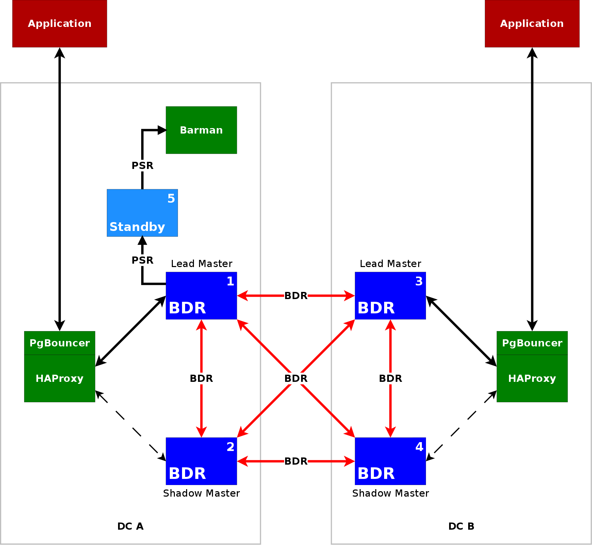

BDR-Always-ON
=============

BDR in an Always-ON configuration, intended for use in production.
(BDR-Simple is an alternative that is more geared towards
experimentation.)

The topology corresponds to v3.1 of the Always-ON architecture.



## Cluster configuration

```
[tpa]$ tpaexec configure ~/clusters/bdr \
         --architecture BDR-Always-ON \
         --platform aws --region eu-west-1 --instance-type t3.micro \
         --distribution Debian-minimal
```

You must specify ``--architecture BDR-Always-ON``. (In the example
above, it is the only option required to produce a working
configuration.)

You may optionally specify ``--bdr-node-group groupname`` to set the
name of the BDR node group (default: bdrgroup).

You may optionally specify ``--bdr-database dbname`` to set the name of
the database with BDR enabled (default: bdrdb).

You may also specify any of the options described by
[``tpaexec help configure-options``](tpaexec-configure.md).
