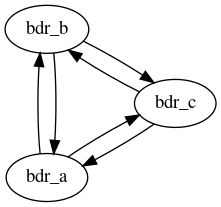

# BDR-Simple

BDR with no frills on N instances, meant primarily for experimentation.
(BDR-Always-ON is an alternative that is more geared towards
production.)

Supports BDRv1 (with BDR-Postgres 9.4),
BDRv2 (with Postgres 9.6 or 2ndQPostgres 9.6), and
BDRv3 (with Postgres or 2ndQPostgres 10 and above).

If you are using BDRv2 or BDRv3 or 2ndQPostgres, you must have access to
the corresponding product repository through the 2ndQuadrant portal.



## Cluster configuration

```
[tpa]$ tpaexec configure ~/clusters/bdr_simple \
         --architecture BDR-Simple --num-instances 3 \
         --bdr-version 2
```

You must specify ``--architecture BDR-Simple``. (In the example above,
this is the only option required to produce a working configuration.)

You may optionally specify ``--num-instances N`` to get a cluster with N
instances (default: 3).

You may optionally specify ``--postgres-version X`` or
``--bdr-version <1|2|3>`` to select the desired Postgres or BDR major
version (defaults: Postgres 11, BDRv3). If you specify only one of the
two, the correct version will be automatically inferred for the other.

Use ``--2Q-repositories products/bdr2/snapshot`` for snapshot packages
of BDRv2 instead of the default release packages, or
``products/bdr3/snapshot products/pglogical3/snapshot`` for snapshot
packages of BDRv3. Add ``products/2ndqpostgres/release`` to the list
to use 2ndQPostgres release packages.

You may optionally specify ``--bdr-node-group groupname`` to set the
name of the BDR node group (default: bdrgroup).

You may optionally specify ``--bdr-database dbname`` to set the name of
the database with BDR enabled (default: bdrdb).

You may optionally specify ``--enable-camo`` to set pairs of BDR
instances to be each other's CAMO partners.

You may also specify any of the options described by
[``tpaexec help configure-options``](tpaexec-configure.md).
