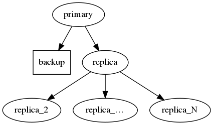

M1
==

The M1 architecture comprises a Postgres primary server with a streaming
replica, a backup server, and any number of additional cascaded
replicas.

By default, the primary has one read-only replica attached; the replica,
in turn, has one cascaded replica attached. The backup server is
configured to take backups from the node initially configured as primary.

Use ``--num-cascaded-replicas N`` to set the number of cascaded replicas
(including 0 for none).



```
[tpa]$ tpaexec configure ~/clusters/speedy --architecture M1 --num-cascaded-replicas 3
```

This architecture supports all of the additional options described on
the [``tpaexec configure``](tpaexec-configure.md) page.
