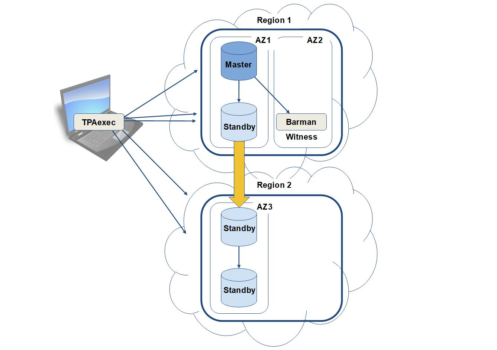

TPAexec - Cluster design and implementation considerations
==========================================================

## Overview

This document discusses the design of clusters with TPAexec.

### AWS Fundamentals

The AWS Elastic Compute Cloud (**EC2**) is physically subdivided first into [Regions](https://docs.aws.amazon.com/AWSEC2/latest/UserGuide/using-regions-availability-zones.html) and further into Availability Zones. Each Availability Zone is isolated, but the Availability Zones in a region are connected through low-latency links. An Availability Zone is represented by a region code followed by a letter identifier; e.g. `eu-east-1a`. Note that `eu-east-1a` might not be the same location as `eu-east-1a` for another account, and there is no way to coordinate Availability Zones between accounts.

Within Availability Zones, you can create [**Instances**](https://docs.aws.amazon.com/AWSEC2/latest/UserGuide/Instances.html) (Virtual Machines) and storage volumes.

The instances are built using templates known as [Amazon Machine Images (**AMI**s](https://docs.aws.amazon.com/AWSEC2/latest/UserGuide/AMIs.html)), which can be preconfigured with OS and bespoke packages, allowing for fast deployment times. These AMIs are region specific, so when creating them, make sure that they are available in each region that you will be using.

Amazon have various HW configs available, known as **[Instance Types](https://docs.aws.amazon.com/AWSEC2/latest/UserGuide/instance-types.html)**, with various price performance points. 

The storage volumes that we use are called [Amazon Elastic Block Store (**EBS**)](https://docs.aws.amazon.com/AWSEC2/latest/UserGuide/AmazonEBS.html) volumes, which provide persistent storage for the server instances.

To specify the protocols, ports, and source IP ranges that can reach the server instances, you can define **[Security Groups](https://docs.aws.amazon.com/AWSEC2/latest/UserGuide/using-network-security.html#vpc-security-groups)**, which are effectively a set of firewall rules.

You can create Virtual networks which are logically isolated from the rest of the AWS cloud, and can optionally be connected to your own network - these are known as virtual private clouds ([**VPC**s](https://docs.aws.amazon.com/AWSEC2/latest/UserGuide/using-vpc.html))

It is possible to assign Static IPv4 addresses to instances, known as **[Elastic IP](https://docs.aws.amazon.com/AWSEC2/latest/UserGuide/elastic-ip-addresses-eip.html)** addresses, or to allow AWS to assign a public IP address from the EC2-VPC public IPv4 address pool. Elastic IPs are region specific, externally accessible IPv4 addresses that are associated with your AWS account, and can be quickly associated with any instance in that region. When you allow AWS to configure an [external IPv4 address](https://docs.aws.amazon.com/AWSEC2/latest/UserGuide/using-instance-addressing.html#concepts-public-addresses), it is configured at instance boot time. *Note this address is released at shutdown time, and it is not possible to retain the same address after reboot.*

During instance build, [key pairs](https://docs.aws.amazon.com/AWSEC2/latest/UserGuide/ec2-key-pairs.html) are created/assigned to allow secure login to the instances. (It is possible to assign existing keys to the instances). If you lose your private key, you will irrevocably lose access to the instances - having access to the AWS console does not help.

------

### Design Considerations

When creating a PostgreSQL cluster using TPAexec, it is worth spending a little preparation time to work out  some of the details. You should decide whether the cluster requires resilience - if so, how much? What topology of replication will be used? 

AWS regions have multiple Availability Zones connected via low-latency links, however Data Centres (**DC**s) hosting all the AZs in a region are hosted in the same geographic location, so consideration should be taken as to what Disaster Recovery (**DR**) resilience is appropriate, and whether DCs should be placed in different regions. An AWS VPC can span multiple AZs, however it does not span regions, so when creating multi-region clusters, something like OpenVPN can be used to provide connectivity.

For a Highly Available (HA) cluster, you will need to place at least 3 DB servers in the main DC (DC 1), so that in the event of the current master failing and a standby being promoted, the new master still has one standby available locally as a failover target.

To achieve DR resilience, you should to place backup standby DB servers in a second DC (DC 2), replicating them directly or by using cascading replication. If using **repmgr** to manage automatic failover, then care needs to be taken to avoid a split-brain scenario. Split-brain can happen when there is a network failure between both DCs, where a DB server in the DC 2 is promoted to master, so that there are masters in both DCs. To avoid this, it's possible to set up a "*witness server*" in DC 1 - if repmgr can't see either the witness or the primary server, it decides that there is a network failure and doesn't promote itself as master.

**Example of cascading replication**



**Figure 1**

In this example, in the event of failure of the master and main standby in Region 1 being promoted to master, no action is necessary for the downstream standbys in Region 2, as they will remain attached to the same host in Region 1, which is now the new master.
The downside of configuring it this way, rather than having each standby replicated from the master, is that the downstream standbys in Region 2 will receive changes more slowly, although this difference might not be significant. We have also designated the barman server as a witness server.

------

### Translating design into reality via config.yml

An example **config.yml** to create the cascading example shown in Figure 1 can be seen below. 

This example requires 3 VPC subnets, and is split between 2 regions, so OpenVPN was used to allow communication - the standby server in AZ1 was chosen as the OpenVPN gateway server, by giving it the role "openvpn-server". Depending on network or CPU performance constraints, it may be preferable to choose a different gateway server.

In order to build the correct topology, the tag "**upstream:** \<Name>" is used, so that the node can be configured to replicate from the required host.

If you are already using AWS in production, it is likely that you will need to use existing ssh keys to connect to the hosts - if this is the case, they can be set using "**ssh_key_file:** \<path to key file>", otherwise you can remove this line and new keys will be generated.

```
---

cluster_name: night
ssh_key_file: "../../id_night"
cluster_tags:
  Owner: Count Drac
cluster_vars:
  vpn_network: 192.168.33.0/24

ec2_vpc:
  Name: Test

ec2_vpc_subnets:
  eu-central-1:
    10.33.243.0/24:
      az: eu-central-1a
    10.33.122.0/24:
      az: eu-central-1b
  eu-west-1:
    10.33.6.0/24:
      az: eu-west-1a

ec2_ami:
  Name: TPA-RedHat-PGDG-10-2018*
  Owner: self
ec2_ami_user: ec2-user

instances:
    - node: 1
      Name: lab-primary
      type: t2.micro
      region: eu-central-1
      subnet: 10.33.243.0/24
      volumes:
          - raid_device: /dev/md0
            device_name: /dev/xvdb
            volume_type: gp2
            volume_size: 16
            raid_units: 2
            attach_existing: yes
            delete_on_termination: false
            vars:
              volume_for: postgres_data
      tags:
        role:
          - primary
          - openvpn-server
        backup: lab-backup
      vars:
        work_mem: 16MB

    - node: 2
      Name: lab-backup
      type: t2.micro
      region: eu-central-1
      subnet: 10.33.122.0/24
      volumes:
          - device_name: /dev/xvdb
            volume_type: gp2
            volume_size: 32
            attach_existing: yes
            delete_on_termination: false
            vars:
              volume_for: postgres_data
      tags:
        role:
          - barman
          - witness
          - log-server
        upstream: lab-primary

    - node: 3
      Name: lab-replica
      type: t2.micro
      region: eu-central-1
      subnet: 10.33.243.0/24
      volumes:
          - device_name: /dev/xvdb
            volume_type: gp2
            volume_size: 16
            attach_existing: yes
            delete_on_termination: false
            vars:
              mountpoint: /var/lib/postgresql
      tags:
        role:
          - replica
          - openvpn-server
        upstream: lab-primary
      vars:
        work_mem: 21MB
        postgres_data_dir: /var/lib/postgresql/data


    - node: 4
      Name: lab-replica2
      type: t2.micro
      region: eu-west-1
      subnet: 10.33.6.0/24
      volumes:
          - device_name: /dev/xvdb
            volume_type: gp2
            volume_size: 16
            attach_existing: yes
            delete_on_termination: false
            vars:
              mountpoint: /var/lib/postgresql
      tags:
        role: replica
        upstream: lab-replica
      vars:
        work_mem: 21MB
        postgres_data_dir: /var/lib/postgresql/data

    - node: 5
      Name: lab-replica3
      type: t2.micro
      region: eu-west-1
      subnet: 10.33.6.0/24
      volumes:
          - device_name: /dev/xvdb
            volume_type: gp2
            volume_size: 16
            attach_existing: yes
            delete_on_termination: false
            vars:
              mountpoint: /var/lib/postgresql
      tags:
        role: replica
        upstream: lab-replica2
      vars:
        work_mem: 21MB
        postgres_data_dir: /var/lib/postgresql/data

```

#### Cluster definition

```
---
architecture: M1

cluster_name: speedy
cluster_tags:
  Owner: roadrunner
cluster_vars:
  vpn_network: 192.168.33.0/24
```

| Parameter:       | Description                                                  |
| :--------------- | ------------------------------------------------------------ |
| architecture:    | Sets architecture type (defaults to M1, which is Single Master) |
| cluster_name:    | This will be the name used to populate the AWS Security groups |
| cluster_tags:    | A hash of tag names and values follows this                  |
| Owner:           | This is used to populate the AWS "Owner" Tag Key (defaults to the user name running tpaexec) |
| cluster_vars:    | Used to set various cluster variables                        |
| vpn_network:     | Sets the VPN network                                         |

#### AWS EC2 parameters

This is a simple example with 2 subnets, 2 availability zones in one AWS region.

```
ec2_vpc:
  Name: Test
  
ec2_vpc_subnets:
  eu-west-1:
    10.33.29.0/28:
      az: eu-west-1a
    10.33.27.16/28:
      az: eu-west-1b
      
ec2_ami:
  Name: TPA-Debian-PGDG-10-2018*
  Owner: self     
```

| Parameter:       | Description                                                  |
| ---------------- | ------------------------------------------------------------ |
| ec2_vpc:         | Used to configure AWS EC2 virtual private cloud - look at [TPA/platforms/aws/provision.yml](https://github.com/2ndQuadrant/TPA/tree/master/platforms/aws/provision.yml). for more information |
| Name:            | Name of VPC - if this is set, then every region must have a VPC called this. VPC must already exist unless **cidr:** parameter is specified. |
| ec2_vpc_subnets: | Used to configure the VPC subnets                            |
| eu-west-1:       | AWS region                                                   |
| 10.33.29.0/28:   | Subnet a                                                     |
| az: eu-west-1a   | AWS Availability Zone                                        |
| 10.33.27.16/28:  | Subnet b                                                     |
| az: eu-west-1b   | AWS Availability Zone                                        |
| ec2_ami:         | Used for setting Amazon Machine Image information            |
| Name:            | AMI name (can include wildcard)                              |
| Owner:           | (Optional) If set to self, then specifies a private AMI      |

For more configuration details on AWS EC2 parameters, see  [AWS EC2 parameters - advanced](#aws-ec2-parameters---advanced)

#### Instance definitions

###### ***Node 1***

```
instance_defaults:
  vars:
    ansible_user: admin

instances:
  - node: 1
    Name: speedy-a
    type: t2.micro
    region: eu-west-1
    subnet: 10.33.14.0/24
    volumes:
        - raid_device: /dev/md0
          device_name: /dev/xvdb
          volume_type: gp2
          volume_size: 16
          raid_units: 2
          attach_existing: yes
          vars:
            volume_for: postgres_data
    role: primary
    vars:
      max_connections: 222
      shared_buffers: '64MB'
```
| Parameter:       | Description                                                  |
| ---------------- | ------------------------------------------------------------ |
| instance_defaults:| Used to specify default parameters for instances            |
| ansible_user:  | Admin user (Parameter ec2_ami_user is now deprecated)|
| instances:       | Used to specify parameters for each system                   |
| - node:          | **1** - Node number for this host. Used by Ansible to configure parameters for hosts. |
| Name:            | Hostname.                                                    |
| type:            | AMI type - changing this can have price and performance implications |
| region:          | AWS region for the host to be created in                     |
| subnet:          | Subnet for this host                                         |
| volumes:         | (Optional) OS specific parameters for creating volumes - in this case a gp2 32GB striped volume, mounted on the default PGDATA location /opt/postgres/data |
| role:            | **primary** - Used to define the server role (may be multiple) - in this case the db primary. Role names include: **primary, replica, barman, witness, log-server, openvpn-server, bdr, postgres-xl, coordinator, datanode, coordinator-replica, datanode-replica, gtm, gtm-standby, pgbouncer, postgres**. See [TPA/roles/platforms/common/tasks/main.yml](https://github.com/2ndQuadrant/TPA/tree/master/roles/platforms/common/tasks/main.yml) for more information. |
| vars:            | Used to override postgresql.conf variables. Note, these are actually set in **0001-tpa_restart.conf** (In Debian under /opt/postgres/data/conf.d/ ) |
| max_connections: | Maximum connections to database                              |
| shared_buffers:  | Memory dedicated to PostgreSQL to use for caching data       |

###### ***Node 2***

```
    - node: 2
      Name: speedy-b
      type: t2.micro
      region: eu-west-1
      subnet: 10.33.14.0/24
      volumes:
          - device_name: /dev/xvdb
            volume_type: gp2
            volume_size: 16
            attach_existing: yes
            vars:
              mountpoint: /var/lib/postgresql
      tags:
        role: replica
        upstream: speedy-a
        backup: speedy-d
```
| Parameter: | Description                                                  |
| ---------- | ------------------------------------------------------------ |
| - node:    | **2** - Node number for this host. Used by Ansible to configure parameters for hosts. |
| volumes:   | (Optional) OS specific parameters for creating volumes - in this case a gp2 16GB volume, mounted on /var/lib/postgresql, the install directory for postgres. |
| tags:      | Used to specify tags for the server                          |
| role:      | **replica** - Used to define the server role - in this case it is a replica. If role is **replica**, then tag **upstream** needs to be defined. See [TPA/roles/platforms/common/tasks/main.yml](https://github.com/2ndQuadrant/TPA/tree/master/roles/platforms/common/tasks/main.yml) for more information. |
| upstream:  | (Optional) Hostname of server that is upstream from this one - **upstream: \<Name>** is used to connect  replicas to upstream servers. In this case speedy-a is replicating to speedy-b |
| backup:    | (Optional) Hostname of backup server                         |

###### ***Node 3***

```
   - node: 3
      Name: speedy-c
      type: t2.micro
      region: eu-west-1
      subnet: 10.33.21.0/24
      volumes:
          - device_name: /dev/xvdb
            volume_type: gp2
            volume_size: 16
            vars:
              volume_for: postgres_data
      tags:
        role: replica
        upstream: speedy-b
```
| Parameter: | Description                              |
| ---------- | ---------------------------------------- |
| - node:    | **3** - Node number for this host        |
| role:      | **replica** - Used to define the server role - in this case it is a replica. If role is **replica**, then tag **upstream** needs to be defined. See [TPA/roles/platforms/common/tasks/main.yml](https://github.com/2ndQuadrant/TPA/tree/master/roles/platforms/common/tasks/main.yml) for more information. |
| upstream:  | (Optional) Hostname of server that is upstream from this one - in this case speedy-b is replicating to speedy-c |

###### ***Node 4***

```
    - node: 4
      Name: speedy-d
      type: t2.micro
      region: eu-west-1
      subnet: 10.33.21.0/24
      volumes:
          - device_name: /dev/xvdb
            volume_type: gp2
            volume_size: 32
            vars:
              volume_for: postgres_data
      tags:
        role:
          - barman
          - witness
          - log-server
          - openvpn-server
        upstream: speedy-a
```
| Parameter:       | Description                              |
| ---------------- | ---------------------------------------- |
| - node:          | **4** - Node number for this host        |
| role:            | Used to define the server role (may be multiple). Role names include: **primary, replica, barman, witness, log-server, openvpn-server, bdr, postgres-xl, coordinator, datanode, coordinator-replica, datanode-replica, gtm, gtm-standby, pgbouncer, postgres**. See [TPA/roles/platforms/common/tasks/main.yml](https://github.com/2ndQuadrant/TPA/tree/master/roles/platforms/common/tasks/main.yml) for more information. |
| - barman         | Installs and configures Barman. See [TPA/roles/barman](https://github.com/2ndQuadrant/TPA/tree/master/roles/barman) for more information. |
| - witness        | Registers this node as a witness. See [TPA/roles/repmgr/witness/final/tasks/main.yml](https://github.com/2ndQuadrant/TPA/tree/master/roles/repmgr/witness/final/tasks/main.yml) for more information. |
| - log-server     | Defines this server as a log server, and makes every other server log to it. See [TPA/roles/platforms/common/tasks/main.yml](https://github.com/2ndQuadrant/TPA/tree/master/roles/platforms/common/tasks/main.yml) for more information. |
| - openvpn-server | Configures this node as an openvpn server. See [TPA/roles/sys/openvpn](https://github.com/2ndQuadrant/TPA/tree/master/roles/sys/openvpn) for more information. |
| upstream:        | (Optional) Hostname of server that is upstream from this one - in this case speedy-a is backing up to speedy-d |

### Volume parameters - advanced

In many installations, it is likely that there are existing company specific standards as to filesystem layouts - an example code snippet is shown below:

```
   volumes:
        - device_name: root
          volume_type: gp2
          volume_size: 16
        - device_name: /dev/xvdb
          volume_type: gp2
          volume_size: 24
          attach_existing: yes
          delete_on_termination: false
          vars:
            mountpoint: /var/lib/pgsql
        - device_name: /dev/xvdc
          volume_type: gp2
          volume_size: 100
          attach_existing: yes
          delete_on_termination: false
          vars:
            mountpoint: /var/lib/pgsql/tblspc_data01
        - raid_device: /dev/md0
          device_name: /dev/xvdd
          volume_type: gp2
          volume_size: 12
          raid_units: 2
          attach_existing: yes
          delete_on_termination: false
          vars:
            mountpoint: /var/lib/pgsql/tblspc_index01
    role: primary
    vars:
      postgres_data_dir: /var/lib/pgsql/tblspc_data01/data
```

This creates 4 different volumes:

- 16GB root volume mounted on /
- 24GB volume mounted on /var/lib/pgsql
- 100GB volume mounted on /var/lib/pgsql/tblspc_data01
- 24GB striped volume mounted on /var/lib/pgsql/tblspc_index01

The postgres data dir is set to /var/lib/pgsql/tblspc_data01/data

In this way it is possible to create extra volumes & associated mount points for each instance.

------

### AWS EC2 parameters - advanced

It is possible to use different VPCs in each region, e.g. specifying VPCs by id, this expanded form maps from region names to a VPC filter specification. If the VPC does not exist, and both Name, cidr are given ( *and* vpc-id is not in filters), it will be created.

###### Example - ec2_vpc with vpc-id specified

```
ec2_vpc:
  eu-west-1:
    Name: SpeedyVPC
    cidr: 192.0.2.0/24
    filters:
      vpc-id: vpc-abcdef
```

| Parameter: | Description                              |
| ---------- | ---------------------------------------- |
| eu-west-1: | AWS Region name                          |
| Name:      | VPC name                                 |
| cidr:      | CIDR                                     |
| filters:   | Allows us to specify the vpc-id          |
| vpc-id:    | Existing VPC id for this region to be used within this VPC (named by **Name:**) |

###### Example - ec2_vpc_subnets - complex

This block is from a more complicated config.

    ec2_ami:
      Name: ubuntu/images/hvm-ssd/ubuntu-xenial-16.04-amd64-server-20170803
    ec2_vpc:
      Name: Test
    
    ec2_vpc_subnets:
      eu-west-1:
        10.33.125.16/28:
          az: eu-west-1b
        10.33.125.32/28:
          az: eu-west-1c
        10.33.125.48/28:
          az: eu-west-1b
        10.33.125.64/28:
          az: eu-west-1c
      eu-central-1:
        10.33.125.80/28:
          az: eu-central-1a
        10.33.125.96/28:
          az: eu-central-1b
        10.33.125.112/28:
          az: eu-central-1a
        10.33.125.128/28:
          az: eu-central-1b
        10.33.125.144/28:
          az: eu-central-1b

In this we can see that 9 subnets have been set up - these are to allow one BDR master instance, two physical replicas, and a corresponding Barman instance in each of the local clusters on two regions, plus a control node.


