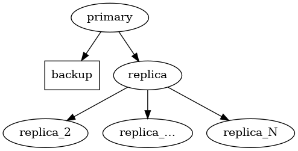

# M1

The M1 architecture is a Postgres cluster with a primary and a streaming replica, one Barman
server, and any number of additional replicas cascaded from the first
one. This architecture is suitable for production. It's also suited to
testing, demonstrating, and learning due to its simplicity and ability to
be configured with no proprietary components.

If you select subscription-only EDB software with this architecture,
it's sourced from EDB Repos 2.0.
See [How TPA uses 2ndQuadrant and EDB repositories](2q_and_edb_repositories.md)
for more detail.

## Default layout

By default, the primary has one read-only replica attached in the same
location. The replica, in turn, has one cascaded replica attached in a
different location, where the Barman server is also configured to take
backups from the primary.



If the number of Postgres nodes is even, the Barman node is 
also configured as a witness. Having an odd number of nodes 
in total helps to establish consensus in case of automatic failover.

## Application and backup failover

The M1 architecture implements failover management in that it ensures
that a replica is promoted to take the place of the primary if
the primary become unavailable. However it doesn't provide any
automatic facility to reroute application traffic to the primary. If
you require automatic failover of application traffic, you must
configure this at the application (for example using multi-host
connections) or by using an appropriate proxy or load balancer and the
facilities offered by your selected failover manager.

This is also true of the connection between the backup node and the
primary created by TPA. The backup isn't automatically adjusted to
target the new primary in the event of failover. Instead, it remains
connected to the original primary. If you're performing a manual
failover and want to connect the backup to the new primary, you can
rerun `tpaexec deploy`. If you want to automatically change the
backup source, implement this using your selected failover
manager.

## Cluster configuration

### Overview of configuration options

This example shows an invocation of `tpaexec configure` for this architecture:

```shell
tpaexec configure ~/clusters/m1 \
         --architecture M1 \
         --platform aws --region eu-west-1 --instance-type t3.micro \
         --distribution Debian \
         --postgresql 14 \
         --failover-manager repmgr
```

You can list all available options using the `help` command:

```shell
tpaexec configure --architecture M1 --help
```

#### Mandatory options

| Parameter                                             | Description                                                                                 |
|-------------------------------------------------------|---------------------------------------------------------------------------------------------|
| `--architecture` (`-a`)                               | Must be set to `M1`.                                                                        |
| Postgres flavour and version (e.g. `--postgresql 15`) | A valid [flavour and version specifier](tpaexec-configure.md#postgres-flavour-and-version). |
| One of: <br> * `--failover-manager {efm, repmgr, patroni}`<br> * `--enable-efm`<br> * `--enable-repmgr`<br> * `--enable-patroni`  | Select the failover manager from [`efm`](efm.md), [`repmgr`](repmgr.md) and [`patroni`](patroni.md).                                                  |


<br/><br/>

#### Additional options

| Parameter                 | Description                                                                                                       | Behavior if omitted                                                                                 |
|---------------------------|-------------------------------------------------------------------------------------------------------------------|------------------------------------------------------------------------------------------------------|
| `--platform`              | One of `aws`, `docker`, `bare`.                                                                                   | Defaults to `aws`.                                                                                   |
| `--num-cascaded-replicas` | The number of cascaded replicas from the first replica.                                                           | Defaults to 1.                                                                                       |
| `--enable-haproxy`        | 2 additional nodes will be added as a load balancer layer.<br/>Only supported with Patroni as the failover manager. | HAproxy nodes will not be added to the cluster.                                                      |
| `--patroni-dcs`           | Select the Distributed Configuration Store backend for patroni.<br/>Only option is `etcd` at this time. <br/>Only supported with Patroni as the failover manager.          | Defaults to `etcd`.                                                                                  |

<br/><br/>

### More detail about M1 configuration

You can optionally specify `--num-cascaded-replicas N` to request N
cascaded replicas (including 0 for none; default: 1).

You can also specify any of the options described by
[`tpaexec help configure-options`](tpaexec-configure.md).
